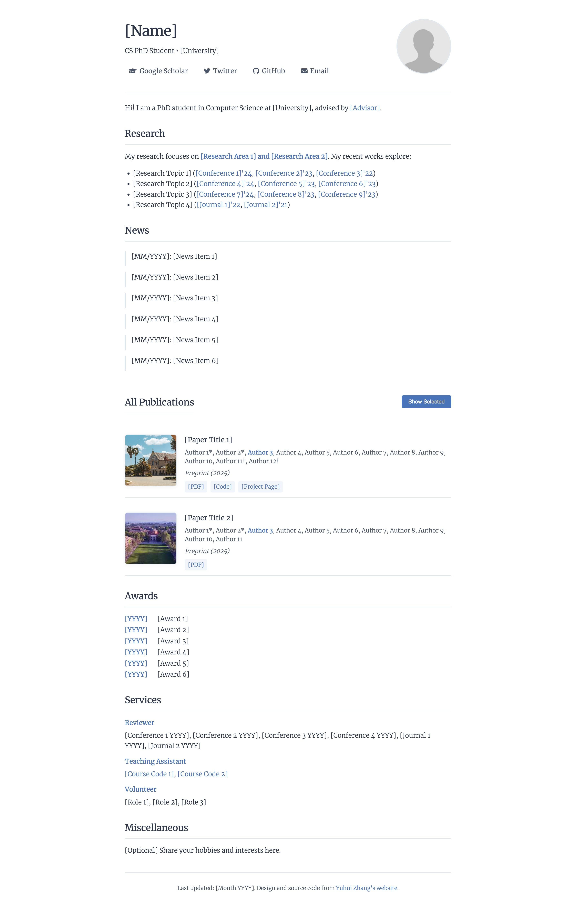

# Dong-Hee Kim - Academic Homepage

The personal academic website of **Dong-Hee Kim**, a PhD student in Artificial Intelligence at Korea University, researching computer vision, vision-language models, and multimodal agents.

Built on a clean, minimal academic website template. The design and source code are from [Yuhui Zhang](https://cs.stanford.edu/~yuhuiz/).



## Features

- Minimalist, academic-focused design
- Responsive layout
- SEO-friendly meta tags
- Publication showcase loaded from `publications.json`

## Local Preview

0. Clone this repository and `cd` into the directory
1. Run `python -m http.server` and visit `http://localhost:8000`

## Customization

- Edit page content (About, Research, News, Experience, Education, Awards, Services, Miscellaneous) in `index.html`
- Update the publication list in `publications.json`
- Replace the profile photo at `images/profile.jpg`
- **Publication thumbnails:** the entries currently reuse the two placeholder images in `images/thumbs/` (`1.jpg`, `2.jpg`). Add real per-paper thumbnails there and point each publication's `thumbnail` field to the correct file.
- The author-name highlight is controlled in `scripts.js` (`author.includes('Dong-Hee Kim')`)

## File Structure

```
.
├── index.html          # Main webpage
├── styles.css          # CSS styling
├── scripts.js          # JavaScript for dynamic content
├── publications.json   # Publication data
└── images/             # Image assets
    ├── profile.jpg
    └── thumbs/         # Publication thumbnails
```

## License

MIT License

---

For the original template and a live example, visit [Yuhui Zhang's website](https://cs.stanford.edu/~yuhuiz/).
